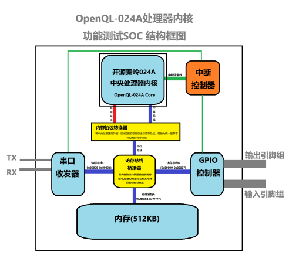

# 内存机制介绍

## 内存大小端介绍

该指令集所有的数据与指令以大端字节存储，指令及内存寻址总线为40位，范围为0x00~0xFFFFFFFFFF，共计1TB。CPU内部都是64位寄存器，所有数据都以64位来进行运算。

示例:

R0寄存器的值为 = `0x77665544332211`

存入内存`0x0000`的位置后，其数据为:

``` 
内存地址: 	0x00    0x01    0x02    0x03    0x04    0x05    0x06
内存数据:	0x77    0x66    0x55    0x44    0x33    0x22    0x11
```

## 对外的内存接口

取指令接口与数据读写接口是2条独立的总线，取指总线支持每次取32bit*4位(每个指令4字节，每次支持最多取4条指令)。数据总线支持选择是取1字节、2字节、4字节、还是8字节数据，数据总线位宽64位，如果是<8字节的数据，数据在靠右的低位进行传输，高位无用。

在硬件上可以选择将其设计为分别连接2个互相独立地址空间的存储器的哈佛架构，也可以将其分别连接到DCache和ICache，最后通过仲裁器连接同一片内存空间，组成冯诺依曼架构。



示例，此SOC中将内存设计为冯诺依曼架构。数据总线与取指总线首先连接到内存协议转换器，内存协议转换器附带仲裁器功能(该仲裁功能较为简单，使用静态仲裁策略，如果两条总线同时访存，优先处理数据总线的)，最终合并为单一的一条访存总线连接到访存桥接器，访存桥接器根据总线发来的要操作的内存地址，将访存请求分别发到不同的外设中。