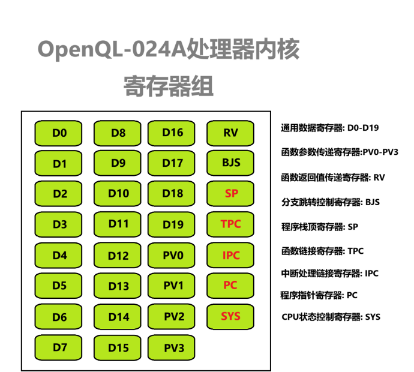

# 寄存器结构介绍

OpenQL024A指令集中总计定义了31个寄存器，分别占用寄存器编号0-31(十进制)，且全部都为64位，进行任意运算时都以64位数来做处理。

## 通用寄存器

* D0-D19:

  这20个是基础通用数据寄存器，可以存储任意C语言的基础数据类型

* PV0-PV3/RV:
  
  此为函数链接寄存器，用于参数传递与传递返回值，如果编译器中发现当前正在编译的函数不需要使用到RV或PV寄存器(满足条件:被编译的函数本身不需要用到且被编译函数所调用的函数也不需要用到)，也可将其用作普通的通用数据寄存器。

* BJS:
  
  此为最终决定后续分支跳转是否要跳转的寄存器。如果在执行一个分支跳转指令时，BJS为0那么就需要跳转，否则就不需要跳转。如果当前被编译的程序中没有用到分支跳转指令，该寄存器也可以被用在通用数据寄存器来保存一般的变量值。

## 专用寄存器

* SP:	
  
  栈顶寄存器，始终指向堆栈顶部。当有一个PUSH指令被执行时，首先会将SP - PUSH的数据位宽，然后在将PUSH的数据值写入SP指向位置。如果POP指令执行时，直接先从SP指向地址读取数据到寄存器，然后将SP的值 + 读的数据位宽。

* TPC: 
  
  函数链接寄存器。但要跳转入函数时，先将要调用的函数地址写入到TPC。然后调用函数跳转命令，此时会同时将PC+4的地址（CALL函数指令的下一条指令地址）写入TPC，并将TPC中的值写入PC，从而完成跳转。在函数返回时，返回指令又重新将TPC中保存的(原先调用程序的PC+4)地址写入PC，从而完成返回。

* IPC: 
  
  中断处理函数链接寄存器。在响应中断异常后，在进入处理程序前CPU硬件自动将异常/中断处理完毕后的恢复地址写入IPC，当要退出中断程序时，就将IPC的地址写入PC即可。

* PC: 
  
  程序指针寄存器，始终指向当前正在取的指令。*该寄存器只读*

* SYS:
  
  CPU当前状态寄存器。不同的CPU架构，该寄存器的各个位代表的含义可以有不同。以OpenQL024A为例，暂且只有2个位有实际用处，其它位保留以便后续的扩展升级。SYS[0]CPU总中断响应是否开启，为1开启，为0将屏蔽所有的异常、软中断、外部中断信号。SYS[1]CPU是否启用保护模式，为1启用，为0不启用。在启用保护模式后会限制许多指令的执行，如不允许执行RST重启指令、执行DI关闭中断响应指令。*该寄存器只读*

## 寄存器编号索引

索引号编码位宽[4:0]

| 寄存器名称 | 索引号  |
| :--------- | :------ |
| D0         | 0b00000 |
| D1         | 0b00001 |
| D2         | 0b00010 |
| D3         | 0b00011 |
| D4         | 0b00100 |
| D5         | 0b00101 |
| D6         | 0b00110 |
| D7         | 0b00111 |
| D8         | 0b01000 |
| D9         | 0b01001 |
| D10        | 0b01010 |
| D11        | 0b01011 |
| D12        | 0b01100 |
| D13        | 0b01101 |
| D14        | 0b01110 |
| D15        | 0b01111 |
| D16        | 0b10000 |
| D17        | 0b10001 |
| D18        | 0b10010 |
| D19        | 0b10011 |
| PV0        | 0b10100 |
| PV1        | 0b10101 |
| PV2        | 0b10110 |
| PV3        | 0b10111 |
| RV0        | 0b11000 |
| BJS        | 0b11001 |
| SP         | 0b11010 |
| TPC        | 0b11011 |
| IPC        | 0b11100 |
| PC         | 0b11101 |
| SYS        | 0b11110 |
| 无效寄存器 | 0b11111 |